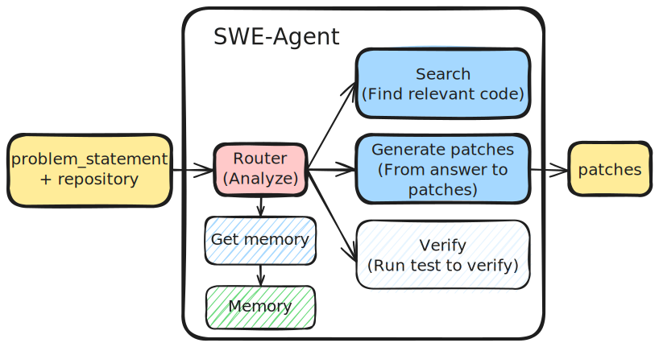

## kprize

Konwinski Contest

### Overview

  

### Action Plan  

✅ **Review Notebooks**: Explore the following resources:  
- [Konwinski Prize Demo Submission](https://www.kaggle.com/code/sohier/konwinski-prize-demo-submission)  
- [Patch Validation Snippet](https://www.kaggle.com/code/sohier/patch-validation-snippet)  
- [KPRIZE - Learn With Me - SWE-Bench and the KPRIZE](https://www.kaggle.com/code/dschettler8845/kprize-learn-with-me-swe-bench-and-the-kprize)  

✅ **Hands-on Practice in Kaggle**: Run models, experiment with the environment, and explore different functionalities.  

✅ **Local Notebook Approach**: Using training data and GPT for solving problems locally first.

❌ **Check Submitted Code**: Check other competitors' submitted code.

❌ **Final Submission**: Finalize and submit the solution (**Deadline: March 2**).

**Key takeaway**:

- Agent avoid hallucination by geting action's feedback from environment.

- Multi-turn agents solve complex tasks more effectively than single-turn agents.

- `gpt-4o` seems to use more tools to clarify tasks compared to `gpt-4`, `gpt-4o-mini`, and others.

### References

- [Fixit](https://fixit.readthedocs.io/en/stable/)

- [comby](https://comby.dev/)

- [ripgrep](https://github.com/BurntSushi/ripgrep)

- [sourcegraph](https://sourcegraph.com/)

- [difflib](https://docs.python.org/3/library/difflib.html)

- [moresearch/swe13b](https://ollama.com/moresearch/swe13b)

- [ollama/ollama](https://github.com/ollama/ollama)

### Codes

- [Starter notebook - Select-Patch-Verify](https://www.kaggle.com/code/huikang/starter-notebook-select-patch-verify)

- [Konwinski Prize - AI GitHub Issue Resolver (TB)](https://www.kaggle.com/code/olaflundstrom/konwinski-prize-ai-github-issue-resolver-tb)

- [Agent System-Langgraph,Vllm,Elasticsearch,Qwen](https://www.kaggle.com/code/jinssaa/agent-system-langgraph-vllm-elasticsearch-qwen)

- [[Konwinski Prize] Gemma LLM](https://www.kaggle.com/code/akhiljethwa/konwinski-prize-gemma-llm)

- [KPrize | Openhands Fork](https://www.kaggle.com/code/smartmanoj/kprize-openhands-fork)

### Contest

- [Konwinski Prize Official Website](https://kprize.ai/)  

- [Kaggle Competition: Konwinski Prize](https://www.kaggle.com/competitions/konwinski-prize/overview)

- [Kaggle Competition: Konwinski Prize - Models](https://www.kaggle.com/competitions/konwinski-prize/models)

### Tools and Benchmarks  

- [SWE-Agent GitHub Repository](https://github.com/SWE-agent/SWE-agent/tree/main)  

- [SWE-Bench GitHub Repository](https://github.com/swe-bench/SWE-bench)  

- [SWE-Bench Official Website](http://www.swebench.com/)  

### Research and Resources on Agents  

- [Agents by Chip Huyen](https://huyenchip.com/2025/01/07/agents.html)  

- [Building Effective Agents - Anthropic Research](https://www.anthropic.com/research/building-effective-agents)  

- [Program Synthesis with Large Language Models](https://arxiv.org/pdf/2108.07732)  

- [SWE-Bench: Can Language Models Resolve Real-World GitHub Issues?](https://arxiv.org/abs/2310.06770)  

- [The DNA of AI Agents: Common Patterns in Recent Design Principles](https://cedricchee.com/blog/the-dna-of-ai-agents/#building-effective-agents)  

### Cutting-Edge Research Papers  

- [Toolformer: Language Models Can Teach Themselves to Use Tools](https://arxiv.org/pdf/2302.04761)  

- [Chameleon: Plug-and-Play Compositional Reasoning with Large Language Models](https://arxiv.org/pdf/2304.09842)  

- [Gorilla: Large Language Model Connected with Massive APIs](https://arxiv.org/pdf/2305.15334)
